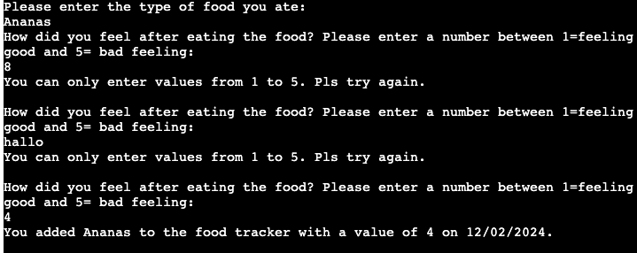

# :purple_circle: *Good Food* :purple_circle:

GoodFood Tracker is a Python application that interacts with Google Sheets to track your food intake and feelings associated with it. It provides a simple console-based interface to add, delete, and search for food entries.

The deployed version can be found [here](https://goodfood-bab2ce8696d3.herokuapp.com/).

## Table of Contents

- [Objective](#objective)
- [User Stories](#user-stories)
- [Key Features](#key-features)
- [Code Structure](#code-structure)
- [Data Model](#data-model)
- [Testing](#testing)
- [Technologies](#technologies)
- [Deployment](#deployment)
- [Project Status](#project-status)
- [Acknowledgements](#acknowledgements)

## Objective

## User Stories

- As a user, I want to add a new food entry so that I can keep track of what I eat and how it makes me feel.

- As a user, I want to see the average feeling of a type of food I ate so that I can understand how different foods affect my mood and well-being.

- As a user, I want to delete a food entry so that I can correct mistakes or remove entries that are no longer relevant.

- As a user, I want to search for food entries by date so that I can review what I ate and how I felt on a specific day.

- As a user, I want to exit the application so that I can end my session when I'm done using the food tracker.

- As a user, I want to see messages printed with a frame so that important information stands out in the console output.

- As a user, I want to interact with a menu so that I can easily choose the operation I want to perform.

- As a user, I want to see validation messages when I enter invalid input so that I can correct my mistakes and learn how to use the application correctly.

- As a user, I want the input for food type to be case-insensitive, so I don't have to worry about the capitalization of my entries.

- As a user, I want to see a table of search results so that I can easily understand and review the data.

- As a user, I want to interact with a Google Sheets document so that my food entries are saved and can be accessed and analyzed later.

## Key Features

### Add a new food entry

- You can add a new food entry with the type of food, your feeling after eating the food (on a scale of 1 to 5).
- The current date will be stored automatically.

### See the average feeling of a typ of food you ate

- You can calculate the average feeling for a specific type of food.

### Delete a food entry for a specific day

- You can delete a food entry by specifying the type of food and the date of the entry.

### Search for food entries by day

- You can search for all food entries on a specific date.
- The results will be displayed in a table.

### Future Features

- As a user, I would like to have an option to visually represent the change in feelings for a specific type of food. I tried to incorporate a plot using matplotlib, but it did not work out with Heroku. Although I could save the plot as a PNG, it was not feasible to display it within the console-based interface.

## Code Structure

The code is structured into the following functions:

- menu(): Displays the menu and handles the user's choice.
- add_food_entry(): Adds a new food entry.
- average_feeling(): Calculates the average feeling for a specific type of food.
- delete_food_entry(): Deletes a food entry.
- search_by_date(): Searches for food entries by date.
- print_with_frame(): Prints messages with a frame.

## Data Model

The data for the GoodFood Tracker is stored in a Google Sheets document. Each row in the sheet represents a food entry and contains the following columns:

- Food: This column stores the type of food that was consumed. It's a string value that is input by the user.
- Feeling: This column stores the user's feeling after consuming the food. It's an integer value between 1 and 5, where 1 represents feeling good and 5 represents feeling bad. This value is also input by the user.
- Date: This column stores the date when the food was consumed. It's a string value in the format "dd/mm/yyyy", and it's automatically set to the current date when a new food entry is added.

## Testing

- ### Input Validation and Error-Checking

- food type input has to be letters (checked for that in all functions)
- feeling has to be a number in the range 1-5

- date input has to be in the correct format

- [PEP8](img/linter.png): No errors, using [CI Python Linter](https://pep8ci.herokuapp.com/)

- Tested in Code Institute Heroku terminal and in my VS Code terminal while coding

### Bugs

- I encountered an issue where the date, stored as a string in my worksheet, was being saved with a leading apostrophe. So my delete_food_entry function did not work and displayed "No entries found for {food_type} on {date}". I discovered that this was a formatting issue with Google Sheets. So I changed the format to "Plain Text" --> solved.

- Given that Python is case-sensitive, I have incorporated the capitalize() function to all user inputs for the food type. This ensures consistency in data entry regardless of how the user inputs the food type.

- After formatting (PEP8) e.g the Average function did not work anymore. The problem has been that I divided the lines but did not know that I have to add another f in the second line for f-strings `print_with_frame(f"The average feeling for {food_type} "
                         f"is {av_feeling}")` --> solved.

## Technologies

Python3 with libraries: gspread google-auth-oauthlib google-auth-httplib2 google-auth prettytable

## Project Status

Project is: finished

## Deployment

### Preparing for Heroku

- Ensure all input has a newline character (`\n`) in the formatted string (f-string).
- To generate a list of project dependencies, use the following command in the terminal: `pip3 freeze > requirements.txt`.

### On Heroku

1. Create a new app by clicking on "New" > "Create new app", enter the app name (e.g., "goodfood"), and click "Create app".
2. Navigate to "Settings" > "Config Vars" and click "Reveal Config Vars". Add the configuration data because Heroku requires it. To do this, add a new variable with the key as `CREDITS` and the value as the content of your `creds.json` file from VS Code.
3. Add buildpacks. It's important to add Python before Node.js (as demonstrated in the "love sandwich" project demo).
4. Navigate to the "Deploy" section.
5. Connect with GitHub and enter your repository name.
6. Decide if you want to deploy manually or enable automatic deployment after every commit to GitHub.
7. Once done, your application will be live. Yippie !

## Acknowledgements

This project was based on full-stack course @ Code Institute.
And an forever thank you 💜 to stackoverflow.
